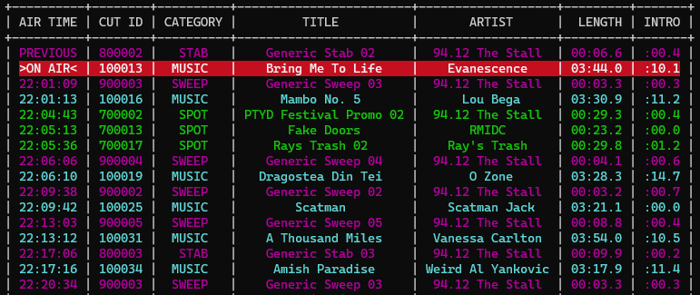

# AZPlayer

A simple audio player intended for unattended long-term playlist automation

> AZPlayer Terminal User Interface

## What AZ Player Is

AZPlayer is a simple audio automation system intended for long-term unattended playback applications.

AZPlayer consists of 3 components:

- Cuts File
- Playlist File
- Audio WAV Files

AZPlayer allows for custom per-cut segue points to be created as well as *topplay* cuts to be designated. TopPlay cuts will play over the intro of the next cut and will automatically hit the post (more details in TopPlay section).

## What AZPlayer Is Not

AZPlayer is not meant to be a live assist automation system. It is meant for unattended looped playback only. You generate a cuts file and playlist file and run the program. **There is no way to interact with the playlist once running** (this may change in the future but is outside the scope of the current project's goals).

## Cuts File

The cuts file, typically `cuts.json` is a JSON file describing all cuts available for playout by AZPlayer.

A small utility, `cutlistgen.py`, is included with AZPlayer for generating a cuts file from an Excel spreadsheet.

### File Structure

| Field | Type | Description |
|--|--|--|
| **id** | *str* | Cut file ID |
| **name** | *str* | Human-readable cut file name |
| **created_at** | *str* | ISO 8601 playlist generation timestamp |
| **cuts** | *object* | Object containing n number of cuts objects (described below) |

    {
        "id": "cuts.json",
        "name": "94.12 The Stall",
        "created_at": "2023-03-19T21:33:22.991960",
        "cuts": {<cuts objects>}
    }

### Cut Object

A cut object is used to describe all information of a single cut. Multiple cut objects will be present within the cuts file.

| Field | Type | Description |
|--|--|--|
| **category** | *str* | Cut category |
| **cut** | *int* | Cut ID |
| **duration** | *int* | Track duration (ms) |
| **meta** | *object* | Track PAD metadata |
| &emsp;**album** | *str* | Track album |
| &emsp;**artist** | *str* | Track artist |
| &emsp;**title** | *str* | Track title |
| **timers** | *object* | Track timer object |
| &emsp;**_track_begin** | *int* | Track start (ms) |
| &emsp;**_track_end** | *int* | Track end (ms) |
| &emsp;**intro_begin** | *int* | Intro start (ms) |
| &emsp;**intro_end** | *int* | Intro end (ms) |
| &emsp;**segue_begin** | *int* | Segue start (ms) |
| &emsp;**segue_end** | *int* | Segue end (ms) |
| **topplay** | *bool* | Designate track as topplay |
| **_links** | *object* | Internal links object |
| &emsp;**audio** | *str* | Path to audio WAV file |
| &emsp;**albumart** | *str* | Path to albumart file |
| **_ui** | *object* | Internal TUI object |
| &emsp;**text_color** | *str* | Color string for use in TUI |

    "100034": {
        "category": "MUSIC",
        "cut": 100034,
        "duration": 199299,
        "meta": {
            "album": "",
            "artist": "Weird Al Yankovic",
            "title": "Amish Paradise"
        },
        "timers": {
            "_track_begin": 0,
            "_track_end": 199299,
            "intro_begin": 0,
            "intro_end": 11426,
            "segue_begin": 197967,
            "segue_end": 199299
        },
        "topplay": false,
        "_links": {
            "audio": "./audio/100034.wav",
            "albumart": "./images/100034.png"
        },
        "_ui": {
            "text_color": "cyan"
        }
    }

### TopPlay

TopPlay allows for tracks to be played over the intro of other tracks. This is intended for playing imaging over the intros of songs and automatically hitting the post.

The action of the TopPlay system will depend on the relationship between the length of the TopPlay enabled track and the length of the next track's intro.

- If the TopPlay track is shorter than or equal to the intro of the next track, both tracks will be started at the same time.

- If the TopPlay track is longer than the intro of the next track, the next track will be delayed for a perfect hit-the-post every time (probably)!

## Playlist File

>**NOTE**: This system is still in development. The file format described below **must** be followed. All transitions will be treated as EOF code 2 (segue) and timed events will all be ignored.

The playlist file, typically `playlist.txt` is a space-delimited ASCII text file describing the order in which audio cuts should be played by AZPlayer

A sample log could look similar to below:

    80002 2 2 00:00:00
    10001 2 0 0
    80001 2 0 0
    10002 0 0 0

This log would say, play cut 80002 at exactly 00:00:00 and then segue into cuts 10001, 80001, and 10002. Then, stop playback once 10002 ends.

The values for the playlist are below:

| Index | Description |
|--|--|
| ``0`` | Cut ID |
| ``1`` | EOF action code *described below* |
| ``2`` | Timed Event Code *described below* |
| ``3`` | Timed Event Timestamp |

### EOF Action Codes

| Code | Description |
|--|--|
| ``0`` | Stop |
| ``1`` | Play |
| ``2`` | Segue |

### Timed Event Codes

| Code | Description |
|--|--|
| ``0`` | No timed action |
| ``1`` | FO Hard Branch |
| ``2`` | FB Hard Branch |
| ``3`` | FO Soft Branch |
| ``4`` | FB Soft Branch |

>Note that timed events only have second accuracy, not the millisecond accuracy found throughout the rest of AZPlay.

## Audio WAV Files

AZPlay currently only supports the playout of wav files. In the future, other file formats and codecs may be supported. There is a plan for creating an audio engine for greater control of audio playout. Other file formats will likely be supported once this work is completed.

## PAD (Program Ancillary Data)

AZPlay writes now playing PAD to a JSON file as well as optionally can send PAD via HTTP.

*PAD system documentation coming soon.*
